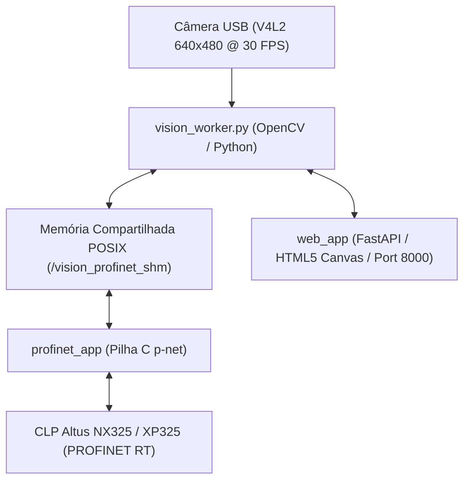

# Guia de Operação e Arquitetura - DAMATTA Vision Device

Este documento descreve o funcionamento completo do **DAMATTA Vision Device**, incluindo o motor de visão computacional, a interface Web HMI, a pilha de comunicação PROFINET RT e o mapeamento IPC por memória compartilhada.

---

## 🏗️ 1. Arquitetura da Solução

O sistema é composto por 3 camadas integradas e desacopladas no Raspberry Pi:

1. **`vision_worker.py` (Motor OpenCV):** Captura imagens continuamente a 30 FPS, executa filtragem de cores HSV, detecção de contornos/formas geométricas, calcula a centroide $(X, Y)$ em milímetros e o ângulo da peça em graus.
2. **`shm_common/vision_ipc.h` (Memória Compartilhada POSIX):** Permite troca instantânea de dados com zero-copy entre o motor Python e a pilha C PROFINET (`/vision_profinet_shm`).
3. **`profinet_app` (Daemon C p-net):** Trata a comunicação determinística PROFINET RT no barramento Ethernet industrial, trocando **20 Bytes de Entrada** (Visão $\rightarrow$ CLP) e **6 Bytes de Saída** (CLP $\rightarrow$ Visão).
4. **`web_app` (FastAPI / HTML5 Canvas):** Interface de usuário responsiva na porta `8000` para calibração ao vivo de HSV, ajuste visual da Região de Interesse (ROI) e diagnóstico.

---

## 📷 2. Classificação de Cores e Formas Geométricas

O motor de visão classifica as peças de acordo com a tabela abaixo:

| ID da Classe (`ClassID`) | Cor Detectada | Faixa HSV Padrão | Aplicação Industrial |
| :--- | :--- | :--- | :--- |
| **`1`** | **Vermelho** | `H: 0-10, S: 100-255, V: 100-255` | Inspeção de Peças Vermelhas |
| **`2`** | **Verde** | `H: 35-85, S: 100-255, V: 100-255` | Inspeção de Peças Verdes |
| **`3`** | **Azul** | `H: 100-130, S: 100-255, V: 100-255` | Inspeção de Peças Azuis |

---

## 🌐 3. Endpoints da Interface Web HMI

Acesse a interface de calibração no navegador em `http://<IP_DO_RASPBERRY>:8000`:

- **`/`**: Dashboard principal com streaming de vídeo MJPEG, controles deslizantes de HSV e editor visual de ROI.
- **`/api/status`**: Retorna os dados atuais da inspeção em formato JSON (status, contagem, $X, Y$, ângulo, receita).
- **`/api/trigger`**: Executa um disparo manual de foto via HTTP REST.
- **`/api/recipes`**: CRUD de receitas de inspeção (GET / POST / DELETE).

---

## 📖 4. Manuais Relacionados

- 👉 **[Tutorial de Configuração no MasterTool IEC XE](TUTORIAL_MASTERTOOL_NEXUS325.md)**
- 👉 **[Plano Arquitetural do Projeto](PLANO_DO_PROJETO.md)**
